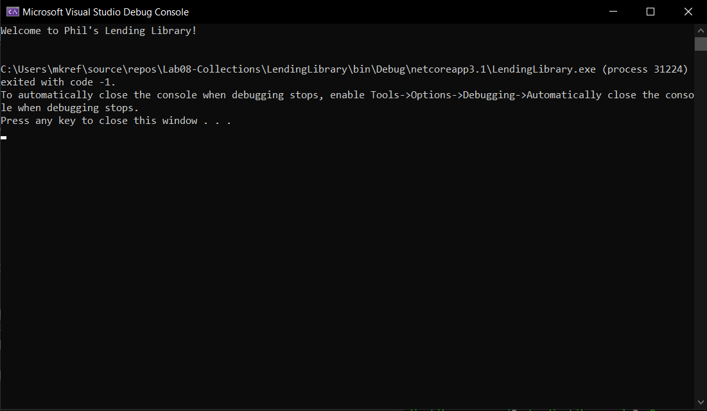

# Lending Library

Lab08-Collections

*Author: Michael Refvem*

----

## Description
This is a C# console application that simulates a library system where user has the ability to manipulate a collection of books.

---

### Getting Started
Clone this repository to your local machine.

```
$ git clone https://github.com/MRefvem/Lab08-Collections.git
```

### To run the program from Visual Studio:
Select ```File``` -> ```Open``` -> ```Project/Solution```

Next navigate to the location you cloned the Repository.

Double click on the ```Lab08-Collections```

Then select and open ```LendingLibrary.sln```

---

### Visuals

#### Application Start


#### Using the Application


#### Application End


---

### Change Log
***[The change log will list any changes made to the code base. This includes any changes from TA/Instructor feedback]***  
1.3: *README updated* - 18 Jul 2020  
1.2: *Feature tasks complete* - 18 Jul 2020  
1.1: *initial commit* - 15 Jul 2020  